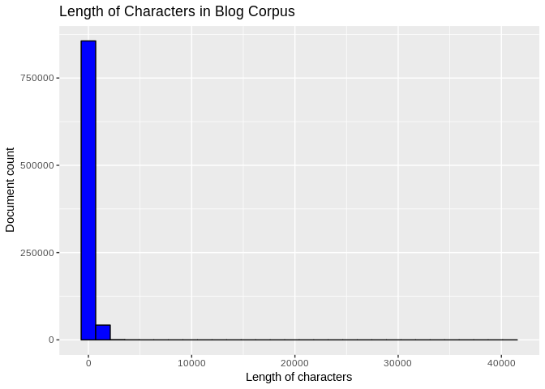
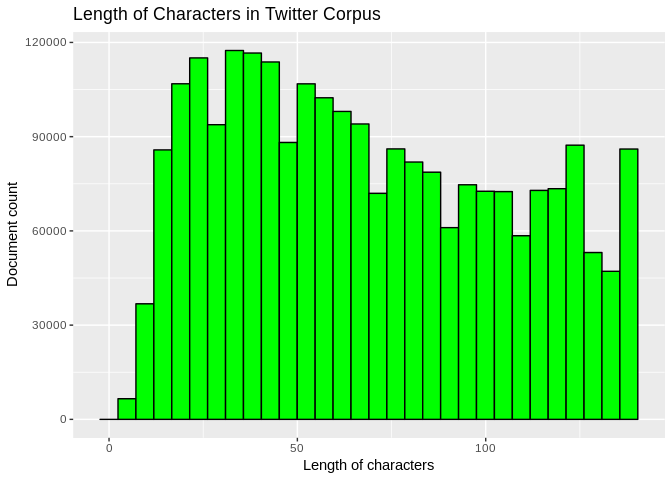
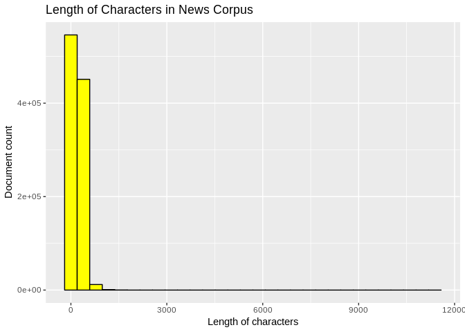
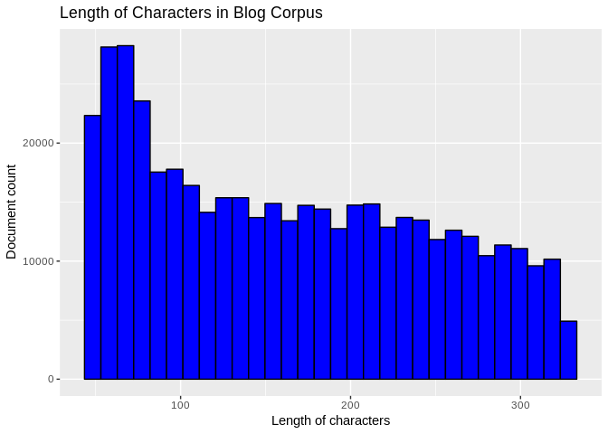
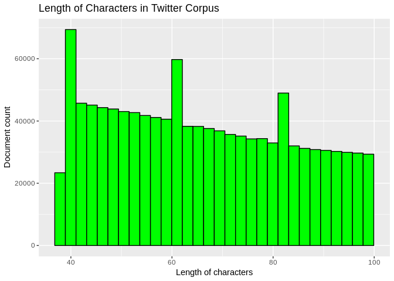
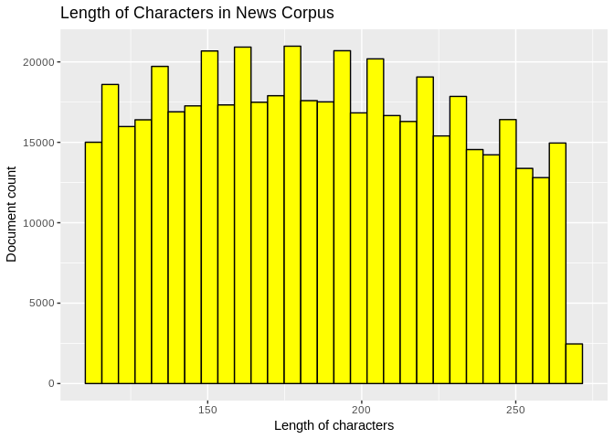
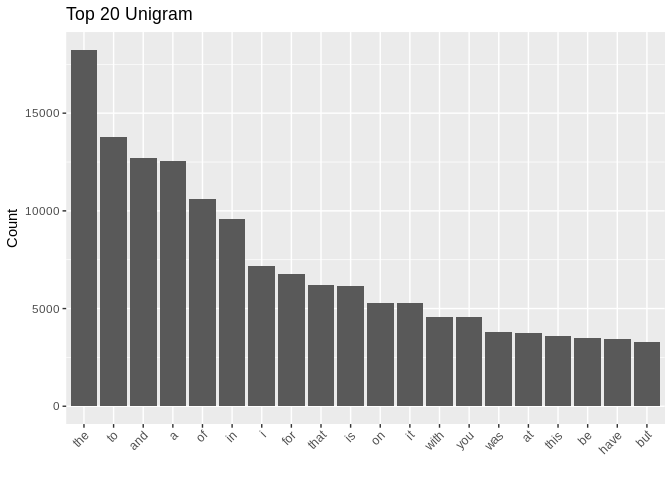
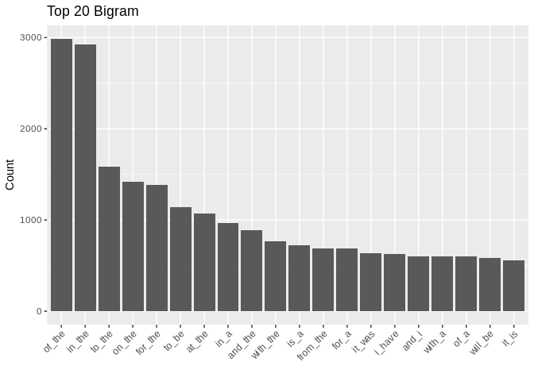
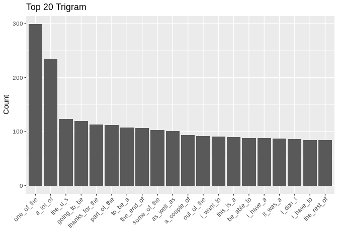

# Loading required libraries and data

Click "code" button on the right to show the requried libraries.


```r
library(ggplot2)
library(RWeka)
library(tm)
library(quanteda)
library(data.table)
```

We load english version of Twitter, news, and blog corpus.


```r
setwd("./corpus/en_US/")

twitter <- readLines("en_US.twitter.txt", skipNul = TRUE, encoding = "UTF-8")
news <- readLines("en_US.news.txt", skipNul = TRUE, encoding = "UTF-8")
blog <- readLines("en_US.blogs.txt", skipNul = TRUE, encoding = "UTF-8")
```

# Exploratory Data Analysis

#### Memory Occupied

Let's check how much memory the corpus occupied in R envorinment.


```r
blog_size <- format(object.size(blog), units = "auto")
news_size <- format(object.size(news), units = "auto")
twitter_size <- format(object.size(twitter), units = "auto")

sprintf("Memory occupied by blog corpus: %s", blog_size)
```

```
## [1] "Memory occupied by blog corpus: 248.5 Mb"
```

```r
sprintf("Memory occupied by news corpus: %s", news_size)
```

```
## [1] "Memory occupied by news corpus: 249.6 Mb"
```

```r
sprintf("Memory occupied by twitter corpus: %s", twitter_size)
```

```
## [1] "Memory occupied by twitter corpus: 301.4 Mb"
```

With the goal of making web application that is accesible from both PC and mobile devices, learning from the whole dataset can cause the application to run extremely slow. Hence, we need to do sampling in building the application.

### Sampling

Let's check the number of documents in each corpus.


```r
twitter_ndocs <- length(twitter)
news_ndocs <- length(news)
blog_ndocs <- length(blog)

sprintf("Number of documents in blog corpus: %s", blog_ndocs)
```

```
## [1] "Number of documents in blog corpus: 899288"
```

```r
sprintf("Number of documents in news corpus: %s", news_ndocs)
```

```
## [1] "Number of documents in news corpus: 1010242"
```

```r
sprintf("Number of documents in twitter corpus: %s", twitter_ndocs)
```

```
## [1] "Number of documents in twitter corpus: 2360148"
```

And see the distribution of the length of characters in each corpus.

#### Distribution of length of characters in Blog corpus


```r
summary(nchar(blog))
```

```
##    Min. 1st Qu.  Median    Mean 3rd Qu.    Max. 
##       1      47     156     230     329   40833
```

```r
qplot(nchar(blog), geom = "histogram", main = "Length of Characters in Blog Corpus", 
      xlab = "Length of characters", ylab = "Document count", fill = I("blue"), col = I("black"))
```

<!-- -->

#### Distribution of length of characters in Twitter corpus


```r
summary(nchar(twitter))
```

```
##    Min. 1st Qu.  Median    Mean 3rd Qu.    Max. 
##    2.00   37.00   64.00   68.68  100.00  140.00
```

```r
qplot(nchar(twitter), geom = "histogram", main = "Length of Characters in Twitter Corpus", 
      xlab = "Length of characters", ylab = "Document count", fill = I("green"), col = I("black"))
```

<!-- -->

#### Distribution of length of characters in News corpus


```r
summary(nchar(news))
```

```
##    Min. 1st Qu.  Median    Mean 3rd Qu.    Max. 
##     1.0   110.0   185.0   201.2   268.0 11384.0
```

```r
qplot(nchar(news), geom = "histogram", main = "Length of Characters in News Corpus", 
      xlab = "Length of characters", ylab = "Document count", fill = I("yellow"), col = I("black"))
```

<!-- -->

The distribution of length of characters are extremely skewed for News and Blog corpus. Some of the documents in all of the corpus even have length of characters as small as 1-2 characters.

Sampling from the whole dataset give us a lot of uncertainty because two undesirable events can occur:

1. Sample with too few characters is useless to make our model smarter

2. Sampling from extremely right skewed distribution as seen in News and Blog corpus restrains us in controlling the amount of memory

For those reasons, we will subset the corpus within each of first to third quantile of length of characters.


Click "code" button on the right to see the code to subset the corpus


```r
FirstToThirdQuantile <- function(corpus) {
    q1 <- quantile(nchar(corpus), .25)
    q3 <- quantile(nchar(corpus), .75)
    corpus <- corpus[nchar(corpus) < q3]
    corpus <- corpus[nchar(corpus) > q1]
    return(corpus)
}

blog <- FirstToThirdQuantile(blog)
twitter <- FirstToThirdQuantile(twitter)
news <- FirstToThirdQuantile(news)
```

#### Distribution of length of characters in subsetted Blog corpus


```r
qplot(nchar(blog), geom = "histogram", main = "Length of Characters in Blog Corpus", 
      xlab = "Length of characters", ylab = "Document count", fill = I("blue"), col = I("black"))
```

<!-- -->

#### Distribution of length of characters in subsetted Twitter corpus


```r
qplot(nchar(twitter), geom = "histogram", main = "Length of Characters in Twitter Corpus", 
      xlab = "Length of characters", ylab = "Document count", fill = I("green"), col = I("black"))
```

<!-- -->

#### Distribution of length of characters in subsetted Blog corpus


```r
qplot(nchar(news), geom = "histogram", main = "Length of Characters in News Corpus", 
      xlab = "Length of characters", ylab = "Document count", fill = I("yellow"), col = I("black"))
```

<!-- -->

This is much better!

#### Generating Samples

After this, we generate our sample with 10,000 sample size. Let's see how much memory it occupies.


```r
GenerateSample <- function(corpus, sample_size = 10000, seed=123) {
    set.seed(seed)
    sample_index <- sample(1:length(corpus), sample_size)
    sample_corpus <- corpus[sample_index]
    return(sample_corpus)
}

blog_sample <- GenerateSample(blog)
twitter_sample <- GenerateSample(twitter)
news_sample <- GenerateSample(news)
```


```r
blog_sample_size <- format(object.size(blog_sample), units = "auto")
news_sample_size <- format(object.size(news_sample), units = "auto")
twitter_sample_size <- format(object.size(twitter_sample), units = "auto")

sprintf("Memory occupied by blog sample: %s", blog_sample_size)
```

```
## [1] "Memory occupied by blog sample: 2.2 Mb"
```

```r
sprintf("Memory occupied by news sample: %s", news_sample_size)
```

```
## [1] "Memory occupied by news sample: 2.3 Mb"
```

```r
sprintf("Memory occupied by twitter sample: %s", twitter_sample_size)
```

```
## [1] "Memory occupied by twitter sample: 1.4 Mb"
```

Take a look to the content of each sample.

**Blog sample**


```r
head(blog_sample, 3)
```

```
## [1] "It has helped my fiction writing immensely. When I read fiction I wrote five or so years ago, I can see the writing. When I read things I write now - well, let's just say that, to use another word thrown around a lot on The Voice (Hi Joel!), I believe the voice wins."                                           
## [2] "I also bought some lovely little embroidery hoops for some pictures I want to make for an arts trail event I am doing. I really do need to get off the computer and make something. Ah now I understand the button tidying. Its a distraction from actually sitting down and making something. It all makes sense now!"
## [3] "approvals from the ministry or the Federal executive council which"
```

**Twitter sample**


```r
head(twitter_sample, 3)
```

```
## [1] "Rewinding that at bat and saw that Fielder just smirks before hitting it out"                        
## [2] "“: \"Tell me Caesar, do I smell like roses to you?\" -Peeta ” LOVE THE MOVIE, JUST LIKE THE BOOK! <3"
## [3] "they say nothing in life is impossible-- well you try to nail jelly to a tree"
```

**News sample**


```r
head(news_sample, 3)
```

```
## [1] "The first events of the day began with about 150 workers such as baggage handlers and cabin cleaners walking off their jobs at LAX around 4 a.m."                            
## [2] "A 26-year-old man was arrested in the Mission District Tuesday evening for allegedly using a potato peeler to rob a man in a restaurant bathroom, San Francisco police said."
## [3] "The blame can largely rest on Anthony, again outclassed by James. Anthony blamed the Heat attentive D, not himself."
```

Finally, we concatenate all of the samples into one corpus and store it in variable `corpus_ori`


```r
corpus_ori <- c(blog_sample, twitter_sample, news_sample)
```

# Text Cleaning

We will do the followings into our new corpus:

1. Remove profanity words

2. Convert to lowecase

3. Remove numbers and special characters


```r
profanity <- readLines("./profanity.txt", encoding = "UTF-8")
corpus <- Corpus(VectorSource(corpus_ori))
changetospace <- content_transformer(function(x, pattern) gsub(pattern, " ", x))
corpus <- tm_map(corpus, content_transformer(tolower)) # convert to lowercase
removeSpecialChars <- function(x) gsub("[^a-zA-Z']"," ",x)
corpus <- tm_map(corpus, removeSpecialChars)
corpus <- tm_map(corpus, stripWhitespace) 
corpus <- tm_map(corpus, removeWords, profanity)

corpus_vector <- content(corpus)
```

# N-gram tokenization

From the cleaned corpus, we then generate unigram, bigram, and trigram tokenization. Let's see the top 20 unigram, bigram, and trigram below, based on the frequencies they appear in our cleaned corpus:


```r
getNgramFreqs <- function(ng, dat, ignores=NULL,
                          sort.by.ngram=TRUE, sort.by.freq=FALSE) {

    if(is.null(ignores)) {
        dat.dfm <- dfm(dat, ngrams=ng, what = "fasterword", verbose = FALSE)
    } else {
        dat.dfm <- dfm(dat, ngrams=ng,  ignoredFeatures=ignores, what = "fasterword", verbose = FALSE)
    }
    rm(dat)
    # quanteda docfreq will get the document frequency of terms in the dfm
    ngram.freq <- docfreq(dat.dfm)
    if(sort.by.freq) { ngram.freq <- sort(ngram.freq, decreasing=TRUE) }
    if(sort.by.ngram) { ngram.freq <- ngram.freq[sort(names(ngram.freq))] }
    rm(dat.dfm)
    
    return(ngram.freq)
}

getNgramTables <- function(ng, linesCorpus, prefixFilter=NULL) {
    ngrams <- getNgramFreqs(ng, linesCorpus)
    ngrams_dt <- data.table(ngram=names(ngrams), freq=ngrams)
    if(length(grep('^SOS', ngrams_dt$ngram)) > 0) {
        ngrams_dt <- ngrams_dt[-grep('^SOS', ngrams_dt$ngram),]
    }
    if(!is.null(prefixFilter)) {
        regex <- sprintf('%s%s', '^', prefixFilter)
        ngrams_dt <- ngrams_dt[grep(regex, ngrams_dt$ngram),]
    }
    
    return(ngrams_dt)
}

unigram <- getNgramTables(1, corpus_vector)
bigram <- getNgramTables(2, corpus_vector)
trigram <- getNgramTables(3, corpus_vector)

unigram <- unigram[order(-rank(freq))]
bigram <- bigram[order(-rank(freq))]
trigram <- trigram[order(-rank(freq))]
unigram <- unigram[complete.cases(unigram),]
```


```r
unigram$ngram <- factor(unigram$ngram, levels = unigram$ngram[order(unigram$freq, decreasing=TRUE)])
bigram$ngram <- factor(bigram$ngram, levels = bigram$ngram[order(bigram$freq, decreasing=TRUE)])
trigram$ngram <- factor(trigram$ngram, levels = trigram$ngram[order(trigram$freq, decreasing=TRUE)])
```


```r
ggplot(unigram[1:20,], aes(x= ngram, y = freq)) +
    geom_bar(stat="identity") +
    labs(title= "Top 20 Unigram", y= "Count", x="") + theme(axis.text.x = element_text(angle = 45, hjust = 1))
```

<!-- -->

```r
ggplot(bigram[1:20,], aes(x= ngram, y = freq)) +
    geom_bar(stat="identity") +
    labs(title= "Top 20 Bigram", y= "Count", x="") + theme(axis.text.x = element_text(angle = 45, hjust = 1))
```

<!-- -->

```r
ggplot(trigram[1:20,], aes(x= ngram, y = freq)) +
    geom_bar(stat="identity") +
    labs(title= "Top 20 Trigram", y= "Count", x="") + theme(axis.text.x = element_text(angle = 45, hjust = 1))
```

<!-- -->


# Future Plan

We have gotten unigram, bigram, and trigram frequencies table. Using this data, we can build application to predict the next word based on user input sentence/phrase.  

Backoff model to generate 4 words prediction using frequencies of the learned N-grams with the higher degree of N-gram as priority can be built. Also, additional smoothing or discounting method, such as Katz's backodd model can be implemented to increase accuracy. However, we must take into account the tradeoff in the speed of computation. 


